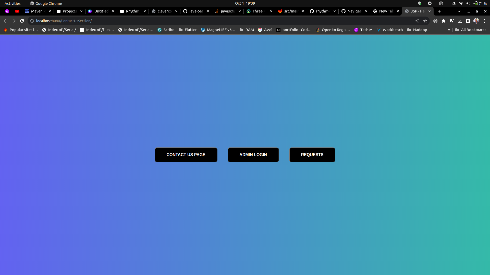
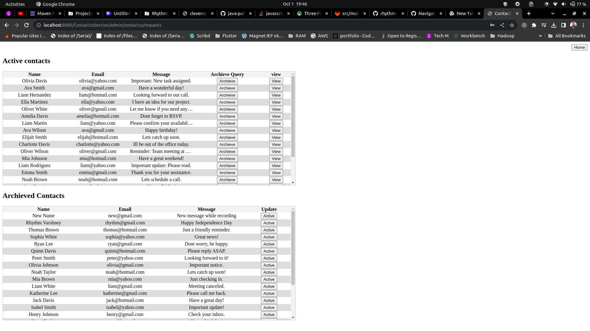
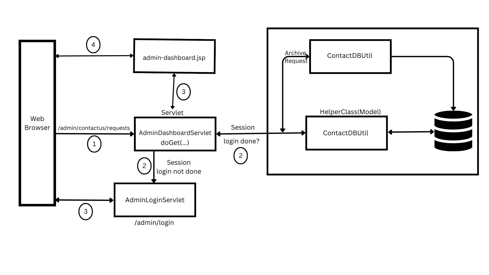

# Contact-Us-Section

* This project is made using JSTL, PostgreSQL, JSP, and Servlets. A fully functional where any customer can submit their query to be responded to by the team once the solution is available.
* Once a solution is provided, the respective team can archive the request so that the request would become inactive.


```
LOGIN CREDENTIALS
Username- admin
Password- 12345
```

<strong> A SQL script is also embedded in project resources to make the structured database
required to run the app. SQL Script is located at-  
</strong>

`src/main/resources/sql/createDatabaseStructure.sql`

# Design Doc for Contact-Us Section
* When the app is launched, the homepage will consist of all the links to the pages. These button are made to make the navigation easy across the different features of the web-app made using JSP and Servlet.
  


<h3>Contact Us Page</h3>
* Through this page, any user/customer can send their message to get it resolved by the team.


* The way Contact Us page works is that it calls a servlet. That servlet will then forward the request to jsp page to load the awesome frontend ready dynamic generated HTML-CSS page. Design structure for this link is


<h3>Admin login page</h3>
* Through this page, a user with admin access can access all the messages of the customers. User needs to be authorized in order to read all the messages from different clients.


* Design logic for admin login page is-


<h3>User requests messages page</h3>
* Through this page, a admin can view all the active and archived request submitted by different users. This page uses less CSS to make page simple.



* Design logic for the admin dashboard (`/admin/contactus/requests`) is




<h3>Single Message View</h3>

*  As we know messages can be quiet bigger and might not fit in table. So, their is view button also, by pressing that admin can view a single query in a nice and minimalist way. Messages can be archieved from here too :)


<h2>Give star to this repo if it is helpful</h2>
